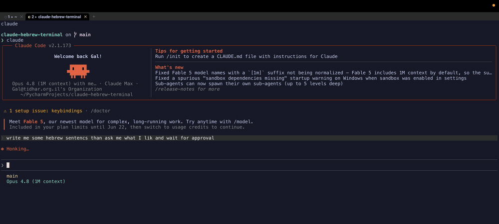
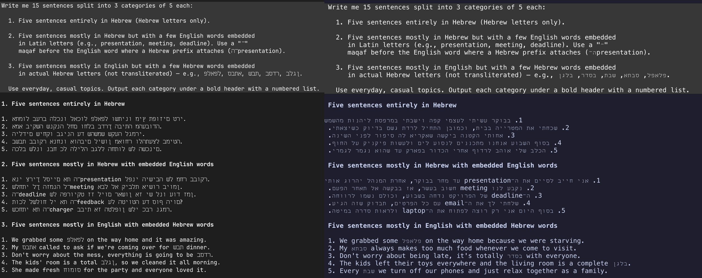

<div align="center">

# 🪬 claude-hebrew-terminal

### Make your terminal read Hebrew — and get a cmux-style AI-agent cockpit for free.

One setup gives you correct **right-to-left Hebrew** in [Claude Code](https://claude.com/claude-code) (and any TUI), plus a tabbed, project-aware, agent-state-aware workflow on **WezTerm**.

<!-- TODO: assets/demo.gif — ⌘P picks a project → claude launches → tab badges go ◐→● → notification → Show focuses the tab -->


</div>

---

## The problem

Most terminals don't run the Unicode **bidirectional (BiDi)** algorithm, so Hebrew comes out **reversed**, and proportional Hebrew fonts add **gaps between letters**. Your agent's output is correct — the terminal just draws it wrong.

<!-- TODO: assets/before-after.png — same Hebrew table: broken (cmux/ghostty) vs correct (WezTerm) -->


```
before:  ומוק ירבח דס      ← reversed words, gappy   (cmux / ghostty / iTerm)
after:   סך חברי קומו       ← right-to-left, tight    (this setup)
```

The fix lives in the **renderer**, so this sets you up on **WezTerm** — one of the only terminals with real BiDi — then makes it feel like the multi-agent terminal you already love.

## Setup — two ways

### A. Let your Claude do it  ·  *recommended*

You already have an AI agent. Paste this into Claude Code and it adapts the setup to your machine (Apple Silicon/Intel, existing config, your projects folder) and verifies each step:

> **Set up my terminal to read Hebrew correctly and run Claude Code agents like cmux. Follow the runbook at https://github.com/tatarco/claude-hebrew-terminal/blob/main/SKILL.md — install it, configure it, and verify Hebrew renders right-to-left.**

### B. One command  ·  *deterministic*

```bash
git clone https://github.com/tatarco/claude-hebrew-terminal
cd claude-hebrew-terminal && ./install.sh   # --no-hooks to skip the Claude integration
open -a WezTerm
```

Installs WezTerm + `Miriam Mono CLM` + `fd` + `glow` + `terminal-notifier`, writes the config, and wires Claude Code hooks. Existing configs are backed up.

## What you get

| Press | Does |
|---|---|
| **⌘P** | Fuzzy-pick a project → opens a tab in it |
| **⌘⇧P** | Fuzzy-pick a project → opens a tab **and** starts `claude` |
| **⌘1–9 / ⌘←→** | Jump / move between tabs · **⌘T** new · **⌘W** close (confirms if an agent is running) |

- **Correct Hebrew/RTL** everywhere — no letter gaps, copy-paste stays in logical order.
- **A tab per agent**, labeled with its project — your cmux-style strip.
- **Live agent-state badges** in the tab: `○` idle · `◐` working · `●` needs you.
- **Actionable notification** — "Claude is waiting · **Show**" whose button focuses the *exact* tab.
- **Smart links** — web → browser; file links → a native popup (Render Markdown / Quick Look / Reveal in Finder / Open in default app / Copy path), relative paths resolved against the tab's folder.

## How it works (the learnings)

- **Direction** — `bidi_enabled` reorders RTL runs for display while keeping logical order internally. Hebrew needs no letter-joining, so WezTerm's one BiDi limitation doesn't bite.
- **Spacing** — Hebrew is served by **Miriam Mono CLM**, a monospace font whose advance matches the Latin font (no gaps). Diagnose any font: `wezterm ls-fonts --text 'שלום'` — uniform `x_adv` = monospace.
- **Agent state** — Claude Code hooks (`UserPromptSubmit`/`Notification`/`Stop`) write each session's state to a file keyed by the WezTerm pane id; WezTerm polls it and recolors the tab.

## Why not cmux / Ghostty / iTerm / Warp?

They render with engines that are **LTR-only** today (Ghostty — and therefore cmux — has no shipped BiDi). A font can't fix direction; the renderer must. WezTerm is the pragmatic answer that also gives a great multi-agent workflow. A tiling-window-manager variant (AeroSpace) lives in [`alternatives/`](alternatives/).

## Use as a Claude Code skill

Drop this repo into `~/.claude/skills/claude-hebrew-terminal/` — the agent reads [SKILL.md](SKILL.md) and runs the whole setup on request.

## License

MIT · by [Gal Tidhar](https://gal.tidhar.org.il)
